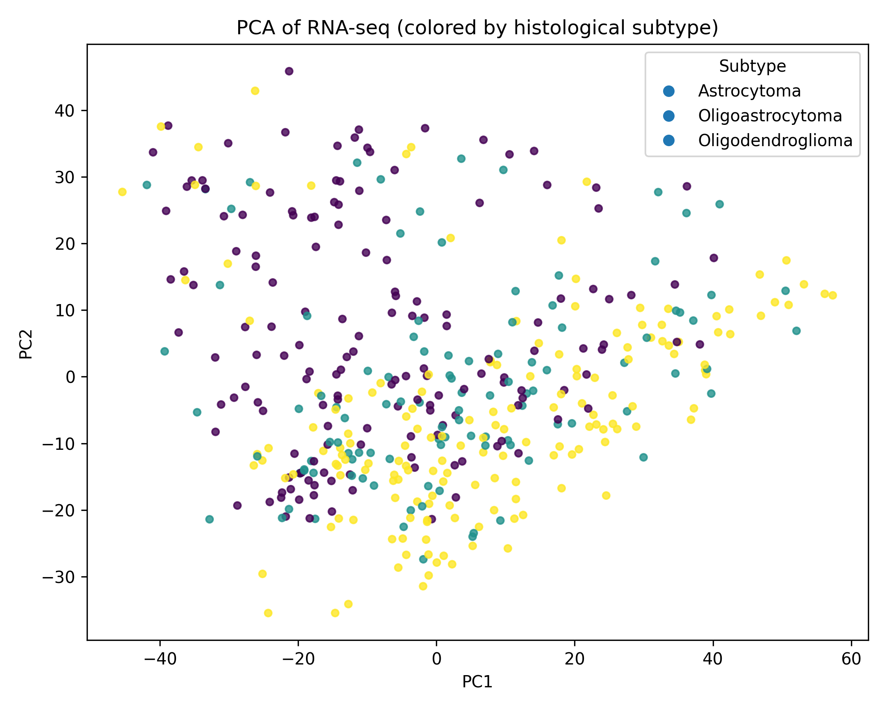
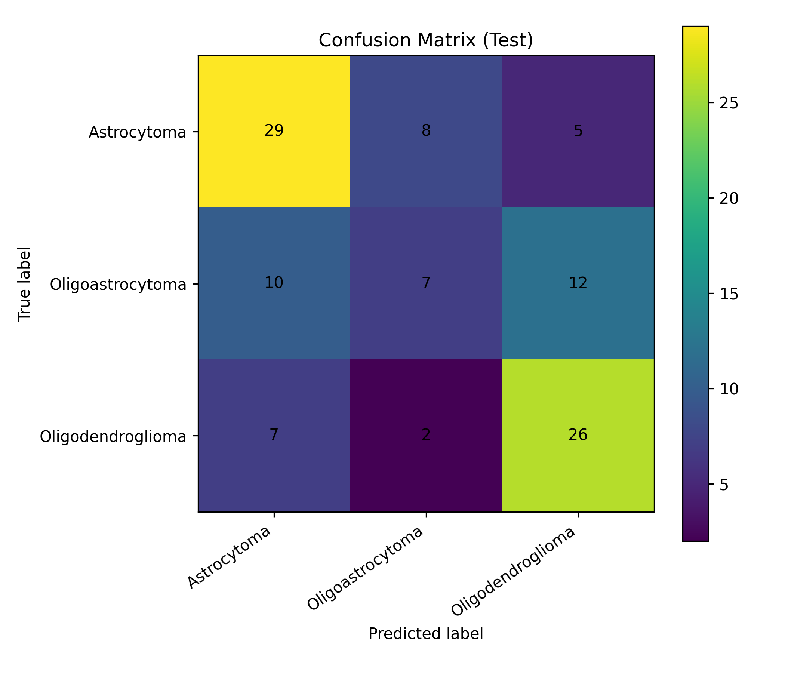
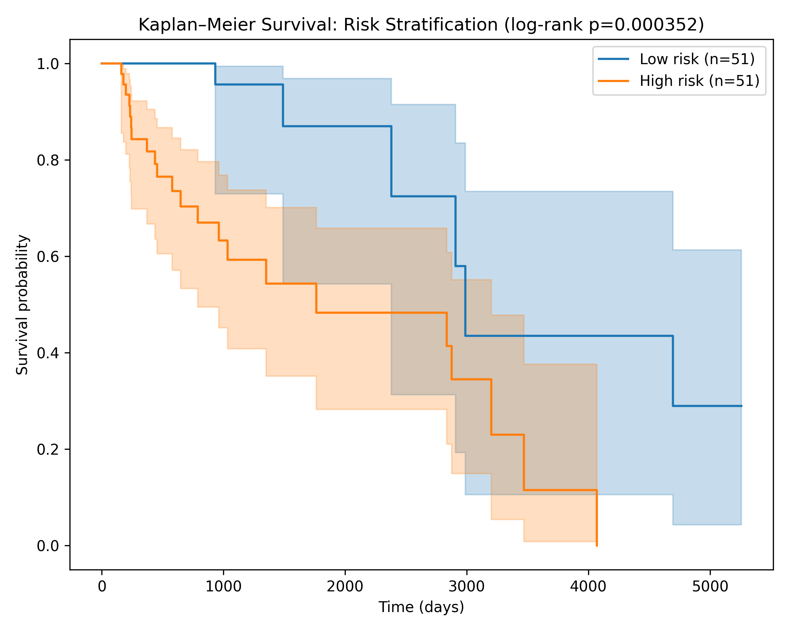
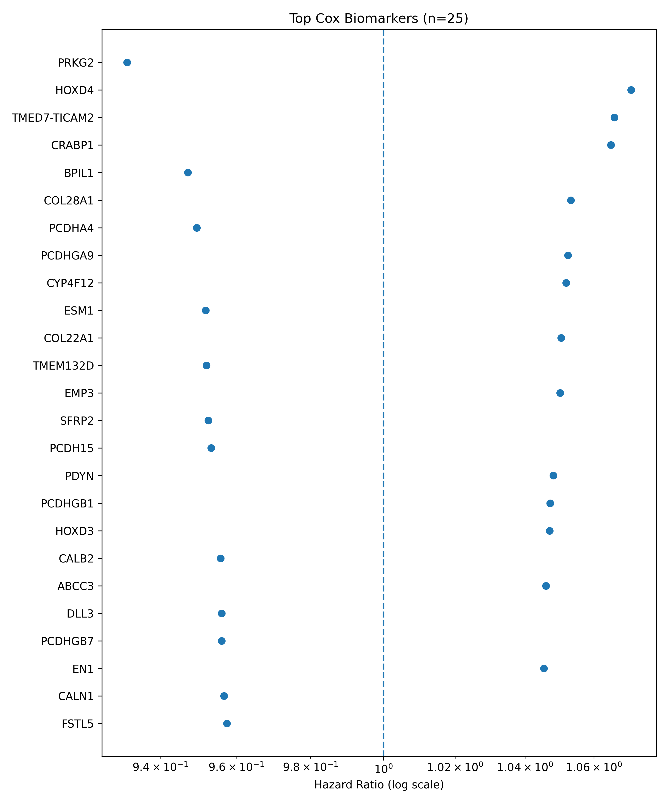
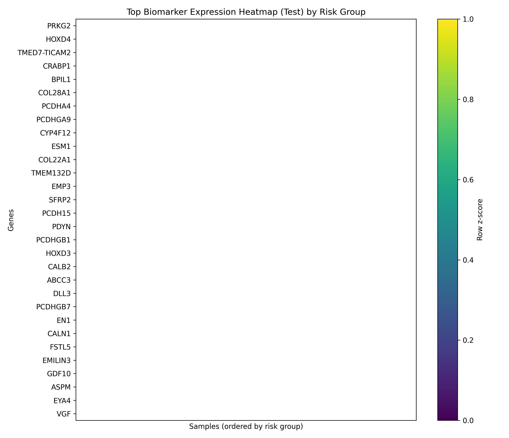
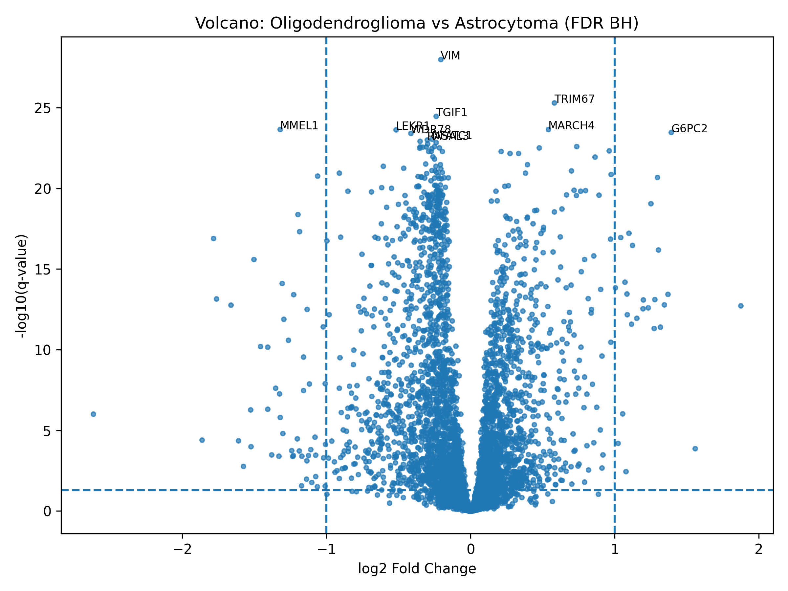

# TCGA-End-to-End-RNA-seq-Subtype-Survival-Biomarkers
pipeline that pulls TCGA data and predicts cancer subtype and survival risk, then explains which genes/pathways drive risk.

## Results: Key Figures (Paper-ready)

> Tip: Click any figure to open it full-size.
---
<table>
  <tr>
    <td width="50%" valign="top">
      <b>Fig 1 — Embedding (PCA/UMAP-style)</b> 
      
      <ul>
        <li>Low-dimensional embedding of RNA-seq profiles.</li>
        <li>Checks whether samples form coherent groups by label.</li>
        <li>Useful sanity-check for batch effects / outliers.</li>
        <li>Separation suggests transcriptomic signal is learnable.</li>
      </ul>
    </td>
---
   </tr> 
    <td width="50%" valign="top">
      <b>Fig 2 — Confusion Matrix</b> 
      
      <ul>
        <li>Class-wise performance for subtype prediction.</li>
        <li>Highlights dominant misclassification patterns.</li>
        <li>Reveals whether errors are symmetric or biased.</li>
        <li>Helpful for deciding which classes need more features / tuning.</li>
      </ul>
    </td>
  </tr>

  <tr>
    <td width="50%" valign="top">
      <b>Fig 3 — Kaplan–Meier (Risk Groups)</b> 
      
      <ul>
        <li>Survival curves for predicted <i>High</i> vs <i>Low</i> risk patients.</li>
        <li>Risk score computed from Cox model predictions.</li>
        <li>Log-rank test quantifies separation significance.</li>
        <li>Demonstrates clinically meaningful stratification from expression data.</li>
      </ul>
    </td>
   </tr> 

  <tr>
    <td width="50%" valign="top">
      <b>Fig 4 — Forest Plot (Top Cox Biomarkers)</b> 
      
      <ul>
        <li>Top survival-associated genes ranked by Cox effect size.</li>
        <li>Positive effects indicate increased hazard (worse prognosis).</li>
        <li>Negative effects indicate protective association (better prognosis).</li>
        <li>Provides an interpretable biomarker shortlist for discussion.</li>
      </ul>
    </td>
  </tr>

  <tr>
    <td width="50%" valign="top">
      <b>Fig 5 — Heatmap (Risk-Stratified Biomarkers)</b> 
      
      <ul>
        <li>Expression patterns of top biomarkers across patients.</li>
        <li>Columns ordered/grouped by predicted risk group.</li>
        <li>Visualizes concordant shifts between high vs low risk cohorts.</li>
        <li>Helps connect model outputs to biological patterns.</li>
      </ul>
    </td>
   </tr>

  <tr>  
    <td width="50%" valign="top">
      <b>Fig 6 — Volcano Plot (Differential Expression)</b> 
      
      <ul>
        <li>Differential expression between two major classes (e.g., Oligo vs Astro).</li>
        <li>Effect size (log2 fold-change) vs significance (-log10 p/FDR).</li>
        <li>Highlights candidate subtype drivers and marker genes.</li>
        <li>Supports biological interpretation beyond pure prediction metrics.</li>
      </ul>
    </td>
  </tr>
</table>
